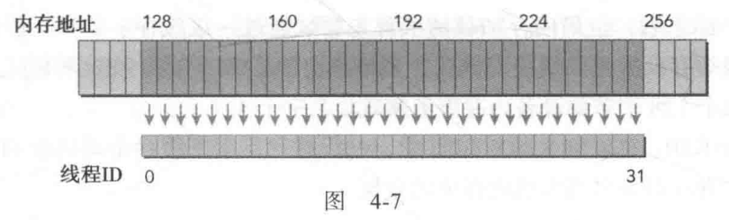
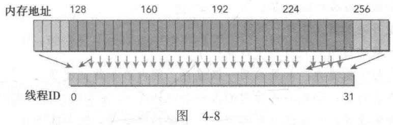
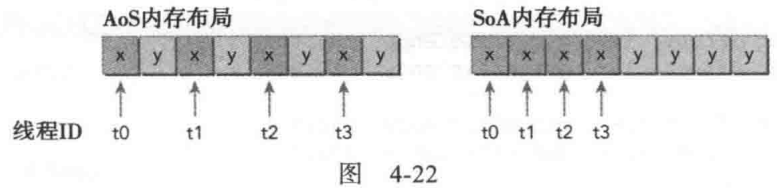

# 4.1 CUDA内存模型概述
CPU和GPU的主存都采用**DRAM**, 低延迟内存使用的是**SRAM**。   
GPU和CPU在内存层次结构设计中都使用相似的准则和模型。 主要区别在于：CUDA让我们能显示的控制内存。

## 4.1.2 CUDA内存模型
CUDA内存模型提出多种**可编程内存**的类型：寄存器、共享内存、本地内存、常量内存、纹理内存、全局内存。  

### 4.1.2.1 寄存器
核函数中声明的一个没有其他修饰符的自变量，通常存储在寄存器中。
1. GPU上运行速度最快的内存空间。
2. 每个线程私有。
3. 生命周期与核函数的生命周期相同.
4. 不同架构对于每个线程最大寄存器数量有限制。一旦超出限制，会用本地内存替代多占用的寄存器。可以在代码中为每个核函数显式的加上额外信息，来帮助编译器进行优化。

### 4.1.2.2 本地内存
核函数中符合存储在寄存器中，但不能进入被该核函数分配的寄存器空间中的变量将溢出到本地内存。比如：
1. 在编译时使用未知索引引用的本地数组
2. 可能占用大量寄存器空间的较大本地结构体或数组
3. 任何不满足核函数寄存器限定条件的变量  

**本地内存中的变量本质上与全局内存在同一块存储区域，高延迟、低带宽！**  
对于计算能力2.0及以上的GPU来说，本地内存数据也是存储在每个SM的一级缓存和每个设备的二级缓存中。

### 4.1.2.3 共享内存
核函数里用\_\_shared\_\_修饰的变量存放在共享内存中。   
每个SM有一定数量的由线程块分配的共享内存。共享内存的生命周期伴随整个线程块。  
SM中的L1 cache和共享内存都使用64KB的片上内存。

### 4.1.2.4 常量内存
用\_\_constant\_\_修饰。
1. 常量变量必须在全局空间内和所有核函数之外进行声明。对同一编译单元中的所有核函数可见。
2. 核函数只能从常量内存中**读取**数据。
3. 常量内存必须在主机端使用 cudaMemcpyToSymbol(const void* symbol, const void* src, size_t count); 初始化。该函数将count个字节从src指向的内存复制到symbol指向的内存中。 这个变量存放在设备的全局内存或常量内存。
4. **每从一个常量内存中读取一次数据，都会广播给线程束里所有线程。** 因此，当线程束中所有线程都从相同的内存地址中读取数据时，常量内存表现最好。

### 4.1.2.5 纹理内存
纹理内存驻留在设备内存中，并在每个SM的只读缓存中缓存。

### 4.1.2.6 全局内存
用\_\_device\_\_修饰。
1. GPU上最大、最慢的内存。
2. 可以在任何SM设备上被访问，贯穿应用程序的整个生命周期。  
全局内存常驻于设备内存中，可通过32、64、128字节的内存事务进行访问。这些内存事务必须自然对齐。

### 4.1.2.7 GPU缓存(不可编程)
GPU上由四种缓存：一级缓存、二级缓存、只读常量缓存、只读纹理缓存。 
每个SM有一个一级缓存，所有SM共享一个二级缓存。一级和二级缓存被用来存储本地内存和全局内存中的数据。  
每个SM也有一个只读常量缓存和只读纹理缓存。

### 4.1.2.8 CUDA变量声明总结

# 4.2 内存管理

## 4.2.1 内存分配和释放

分配全局内存：cudaMalloc(void **devPtr, size_t count);    
初始化：cudaMemset(void **devPtr, int value, size_t count);  (不要用) 
释放全局内存：cudaFree(void *devPtr, int value, size_t count);

## 4.2.2 内存传输
传输数据：cudaMemcpy(void *dst, const void *src, size_t count, kind);   kind有四种   
CPU与GPU之间通过PCIe总线连接，其带宽比GPU芯片和GPU内存之间的带宽要低很多。 因此，尽量减少主机和设备之间的传输。

## 4.2.3 固定内存
1. **主机内存**默认是pageable，但是GPU不能在可分页主机内存上安全的访问数据(操作系统可能移动数据)。 当从可分页主机内存传输数据到设备内存时，**CUDA驱动程序先分配临时页面将主机数据复制到固定内存,再从固定内存传输给设备内存**。 
2. **也可以直接分配固定主机内存：cudaMallocHost(void \*\*devPtr, size_t count);  这样分配的主机内存是页面锁定的，设备可以直接访问。 由于设备可以直接访问，其带宽比可分页内存的读写带宽高得多。**  
3. 分配过多的固定内存可能会导致主机系统性能下降，因为减少了用于存储虚拟内存数据的可分页内存数量。

释放固定主机内存：cudaFreeHost(void *ptr);

## 4.2.4 零拷贝内存
??

## 4.2.5 统一虚拟寻址UVA
UVA使得主机内存和设备内存可以共享同一个虚拟地址空间。(在UVA之前，需要管理哪些指针指向主机内存，哪些指针指向设备内存)。  
通过UVA,有cudaHostAlloc分配的固定主机内存具有相同的主机和设备指针。可以将返回的指针直接传递给核函数。

## 4.2.6 统一内存寻址
？？

# 4.3 内存访问模式
在执行内存指令时，线程束中的每个线程都提供了一个正在加载或存储的内存地址。根据线程束中内存地址的分布，内存可以访问可以被分成不同的模式。

## 4.3.1 对齐与合并访问
1. 全局内存通过缓存来实现加载/存储。所有的应用程序数据最初都在DRAM上。核函数的内存请求通常是在DRAM设备和片上内存间以128字节或32字节内存事务来实现。
2. 所有对全局内存的访问都会通过二级缓存，部分访问还会通过一级缓存，取决于访问类型和GPU架构。
3. 如果一、二级缓存都被用到，那么内存访问是由一个128字节的内存事务实现的；否则，是由一个32字节的内存事务实现的。

设备内存访问的两个特性：**1.对齐内存访问， 2.合并内存访问。**    
1. 当设备内存事务的第一个地址是缓存粒度的偶数倍时(32字节的二级缓存或128字节的一级缓存)，就会出现对齐内存访问。此时如果运行非对齐的加载会造成带宽浪费。  
2. 当一个线程束中全部的32个线程访问一个连续的内存块时，就会出现合并内存访问。   
 
 

对齐合并后，图4-7只需要一个128字节的内存事务从设备内存中读取数据。 非对齐非合并，图4-8需要3个128字节的内存事务，浪费带宽。

## 4.3.2 全局内存读取
在SM中，数据通过：1.一/二级缓存；2.常量缓存；3.只读缓存；三种方式进行传输，具体用哪种取决与引用哪种类型的设备内存。 其中，一/二级缓存是默认路径，其他两种需要程序显示说明。  
全局内存加载操作是否通过一级缓存取决于：设备的计算能力和编译器选项。  
1. 如果一级缓存被禁用，所有对全局内存的加载请求直接进入二级缓存；如果二级缓存缺失，则由DRAM完成请求。此时，每一次内存事务可由32、64或128字节的内存事务实现。
2. 如果一级缓存被启用，全局内存加载请求依次尝试通过：一级、二级、DRAM。 这种情况下，一个内存加载请求由一个128字节的设备内存事务实现。

### 4.3.2.1 缓存加载
缓存加载操作经过一级缓存，在粒度为128字节的一级缓存行上由设备内存事务进行传输。缓存加载可以分为对齐/非对齐以及合并/非合并。

**CPU一级缓存和GPU一级缓存的差异：CPU一级缓存优化了时间和空间局部性。GPU一级缓存是专为空间局部性而不是为时间局部性设计的。频繁访问一个一级缓存的内存位置不会增加数据留在缓存中的概率。**

### 4.3.2.2 没有缓存的加载
没有缓存的加载不经过一级缓存，在**内存段的粒度上(32字节)** 而不是**缓存池的粒度(128字节)** 执行。

### 4.3.2.4 只读缓存
1. 只读缓存最初是预留给纹理内存加载使用。对于新的GPU，只读缓存也支持使用全局内存加载代替一级缓存。
2. 只读缓存的加载粒度是32字节。

两种方式指导内存通过只读缓存进行读取：
1. 使用函数__ldg:    out[idx] = __ldg(&in[idx])
2. 在间接引用的指针上使用修饰符__restrict__:  void copyKernel(int * \_\_restrict\_\_ out, int * \_\_restrict\_\_ in ) { ... }

## 4.3.3 全局内存写入
1. 一级缓存不能用在Fermi或Kepler GPU上进行存储操作，只能通过二级缓存。
2. 存储操作的粒度是32字节段。
3. 内存事务可以选择：32、64、128字节。

## 4.3.4 结构体数组(SoA)与数组结构体(AoS)
1. AoS:  某种结构体的数组
2. SoA:  关于数组的结构体

一般更推荐SoA

## 4.3.5 性能调整
优化设备内存带宽利用率的两个目标：
1. 对齐合并内存访问，减少带宽浪费
2. 足够的并发内存操作来隐藏内存延迟

