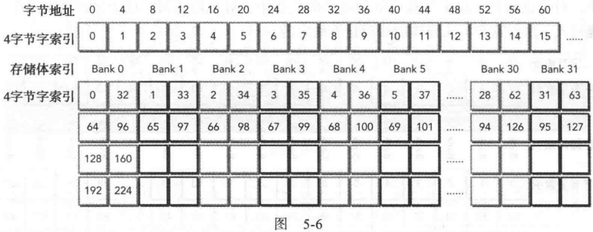

# 5.1 CUDA共享内存概述

GPU中有两种类型的内存：1. 板载内存；2. 片上内存。 全局内存是较大的板载内存，共享内存是较小的片上内存。  
共享内存的常见用途：
1. 块内线程通信的通道
2. 用于全局内存数据的可编程管理的缓存
3. 高速暂存存储器，用于转换数据以优化全局内存访问模式

## 5.1.1 共享内存(SMEM)
1. 物理上，每个SM都有一个小的低延迟内存池，被当前正在该SM上执行的线程块中的所有线程共享。
2. 每个线程块开始执行时，会分配一定数量的共享内存。其内容和对应线程块的生命周期相同。
3. 如果多个线程访问共享内存中的同一个字，一个线程读取该字后会通过多播把它发送给其他线程。

## 5.1.2 共享内存分配
共享内存可在核函数中声明(作用域为该内核)，也可以在所有核函数外面声明(所有核函数都可见)。  
可以用extern关键字声明一个未知大小的**一维数组**。  extern \_\_shared\_\_ int array[]; 在每个核函数被调用时，可以把所需的数组大小传入：kernel<<<grid, block, size*sizeof(int)>>> (...)

## 5.1.3 共享内存存储体和访问模式

### 5.1.3.1 内存存储体
1. 为了获得高内存带宽，共享内存被分为32个同样大小的内存模型，它们被称为存储体，可以被同时访问。
2. **共享内存是一个一维地址空间。**
3. **如果线程束发布共享内存加载或存储操作，且在每个存储体上只访问不多于一个的内存地址，那么该操作可由一个内存事务来完成。负责，需要多个内存事务。**

### 5.1.3.2 存储体冲突
当多个地址请求落在相同的存储体中时，会发生存储体冲突，导致请求被重复执行。  
线程束发出共享内存请求时，有三种模式：
1. 并行访问：多个地址访问多个存储体
2. 串行访问：多个地址访问同一个存储体
3. 广播访问：单一地址读取单一存储体

### 5.1.3.3 访问模式
共享内存**存储体的宽度**规定了共享内存地址和存储体的对应关系。 有两种不同的存储体宽度：4字节(32位)和8字节(64位)。  
**对于Fermi设备：**  
4字节的宽度，$存储体索引 = (字节地址 / 4)\%32存储体 $.  每个存储体在每两个时钟周期内都有32位带宽 
当线程束中的两个线程访问**相同地址**时，不会发生存储体冲突。对于读访问，这个字会被广播到请求的线程中。对于写访问，这个字只能由一个线程写入，执行的线程是不确定的。  

**对于Kelper设备：**  
有4字节和8字节两种模式。 在每个时钟周期内每个存储体都有64位的带宽。 
8字节模式下：$存储体索引 = (字节地址 / 8)\%32存储体 $   
**32位模式下：连续的32位字映射到连续的存储体中(映射到不同的存储体中)**。由于Kepler在每个时钟周期有64位带宽，所以访问同一存储体的两个32位字不一定会发生存储体冲突。 如下图中4字节索引0和4字节索引32：

### 5.1.3.5 访问模式配置
调用：cudaDeviceGetSharedMemConfig(cudaSharedMemConfig *pConfig), 会把结果返回到pConfig中，返回的存储体配置是下列值中的一个：cudaSharedMemBankSizeFourByte, cudaSharedMemBankSizeEightByte. 
通过cudaDeviceSetSharedMemConfig(cudaSharedMemConfig config)设置新的存储体大小。

## 5.1.5 同步

### 5.1.5.1 弱排序内存模型
GPU线程在不同内存中写入数据的顺序不一定和这些数据在源代码中访问的顺序相同。 
如果指令相互独立，线程从不同内存中读取数据的顺序和读指令在程序中出现的顺序不一定相同。

# 5.2 共享内存的数据布局

## 5.2.1 方形共享内存
